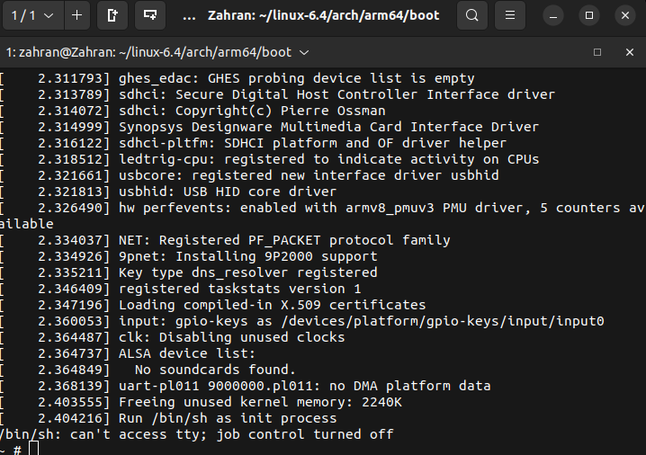

## Root filesystem
In Linux, the root filesystem (often abbreviated as "rootfs") is the top-level directory structure of the operating system, and it serves as the foundation for all other filesystems. This root filesystem is represented by the / directory, commonly called the "root directory." Every file, directory, and mounted filesystem can be accessed as a subdirectory of /, making it the entry point of the entire directory tree in Linux.

## Boot process 
Boot Process: During the Linux boot process, the kernel loads the root filesystem into memory to access essential files needed for system initialization. The root filesystem provides the basic environment and file access for the kernel and other early startup programs.

## Prerequistes to make minimal file system:
• **init**: This is the program that starts everything off, usually by running a series of scripts. I will describe how init works in much more detail in Chapter 13, Starting
Up – The init Program.
• **Shell**: You need a shell to give you a command prompt but, more importantly, also to run the shell scripts called by init and other programs.
• **Daemons**: A daemon is a background program that provides a service to others. Good examples are the system log daemon (syslogd) and the secure shell daemon(sshd). The init program must start the initial population of daemons to support the main system applications. In fact, init is itself a daemon: it is the daemon that provides the service of launching other daemons.
• **Shared libraries**: Most programs are linked with shared libraries and so they must be present in the root filesystem.
• **Configuration files**: The configuration for init and other daemons is stored in a series of text files, usually in the /etc directory.
• **Device nodes**: These are the special files that give access to various device drivers.
• **proc and sys**: These two pseudo filesystems represent kernel data structures as a hierarchy of directories and files. Many programs and library functions depend
on /proc and /sys.
• **Kernel modules**: If you have configured some parts of your kernel to be modules, they need to be installed in the root filesystem, usually in /lib/modules/

## FileSystem Hierarchy 
```cpp
man hier
```

• /bin: Programs essential for all users
• /dev: Device nodes and other special files
• /etc: System configuration files
• /lib: Essential shared libraries, for example, those that make up the C library
• /proc: Information about processes represented as virtual files
• /sbin: Programs essential to the system administrator
• /sys: Information about devices and their drivers represented as virtual files
• /tmp: A place to put temporary or volatile files
• /usr: Additional programs, libraries, and system administrator utilities, in the
/usr/bin, /usr/lib, and /usr/sbin directories, respectively
• /var: A hierarchy of files and directories that may be modified at runtime, for
example, log messages, some of which must be retained after boot

## make rootfs
```cpp 
zahran@Zahran:~/rootfs$ mkdir ~/rootfs
zahran@Zahran:~/rootfs$ mkdir bin dev etc home lib proc sbin sys tmp usr var
zahran@Zahran:~/rootfs$ mkdir usr/bin usr/lib usr/sbin
zahran@Zahran:~/rootfs$ mkdir -p var/log
zahran@Zahran:~/rootfs$ tree -d 

git clone git://busybox.net/busybox.git
cd busybox

make distclean
make ARCH=arm64 CROSS_COMPILE=<prefix_toolchain> menuconfig ---> for PREFIX install.
make ARCH=arm64 CROSS_COMPILE=aarch64-rpi3-linux-gnu- menuconfig

/home/zahran/x-tools/aarch64-rpi3-linux-gnu/bin

rsync -avh /path/source /path/to/destination/
rsync -avh . /home/zahran/linux-6.4/arch/arm64/boot/rootfs

//mkinitramfs

sudo find . -print0 | sudo cpio --null -ov --format=newc > initramfs.cpio
sudo find . -print0 | sudo cpio --null -ov --format=newc | sudo tee initramfs.cpio > /dev/null

//initramfs.cpio is produced 
gzip initramfs.cpio


qemu-system-aarch64 -M virt -cpu cortex-a53 -m 1G -kernel Image  -append "console=ttyAMA0 rdinit=/bin/sh" -initrd initramfs.cpio.gz -nographic

```

