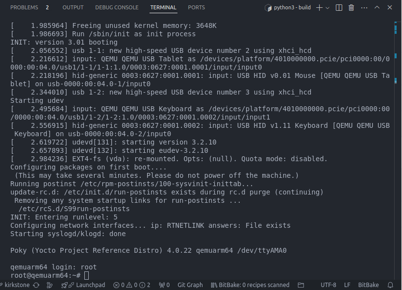

## Motivation


## Build systems: open embedded
-Open Embedded: Standerd MetaData + build engine(bitbake)

## YOCTO Project 
-creates custom embedded linux distribution for you 
-POKY: Hello world Distribution

## building and testing raw poky 
1-install poky 
2- source the build:
``` source oe-init-build-env ```
3-change conf in build/local.conf --> machine and number of threads --> 
``` 
BB_NUMBER_THREADS="12"
PARALLEL_MAKE="-j 8"
```
4-set target machine
5-build the image 
```
bitbake core-image-minimal
```
6-run qemu:
```
runqemu <machine> no graphic
```



